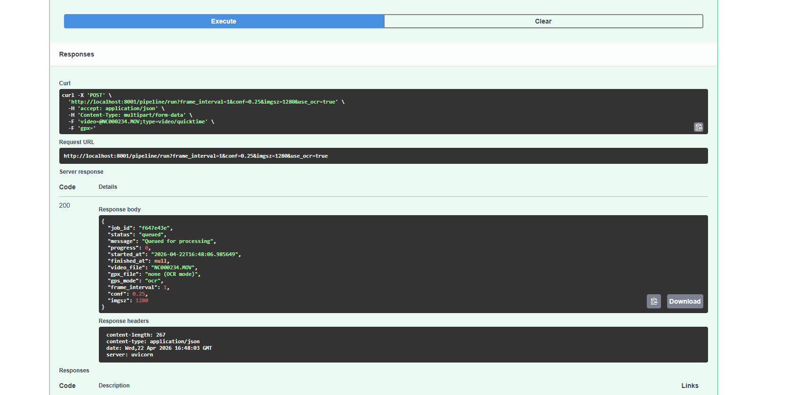
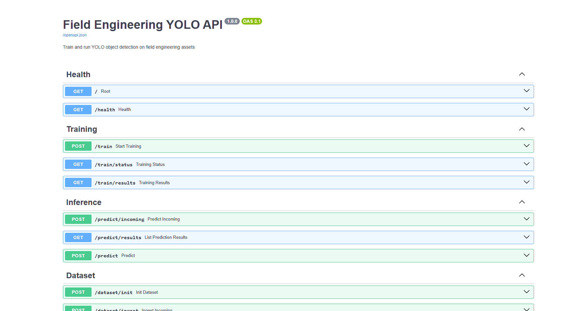
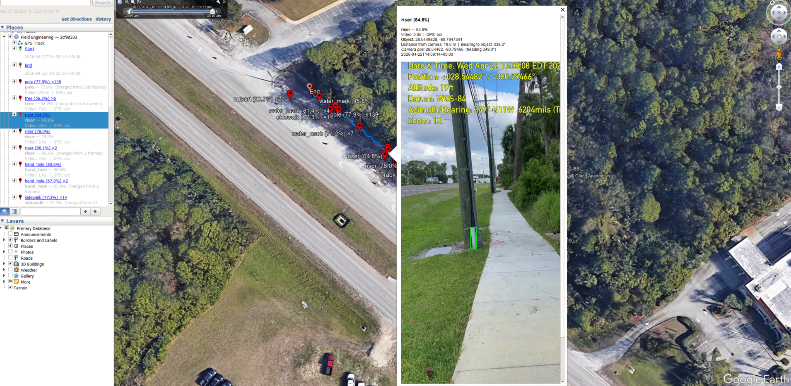
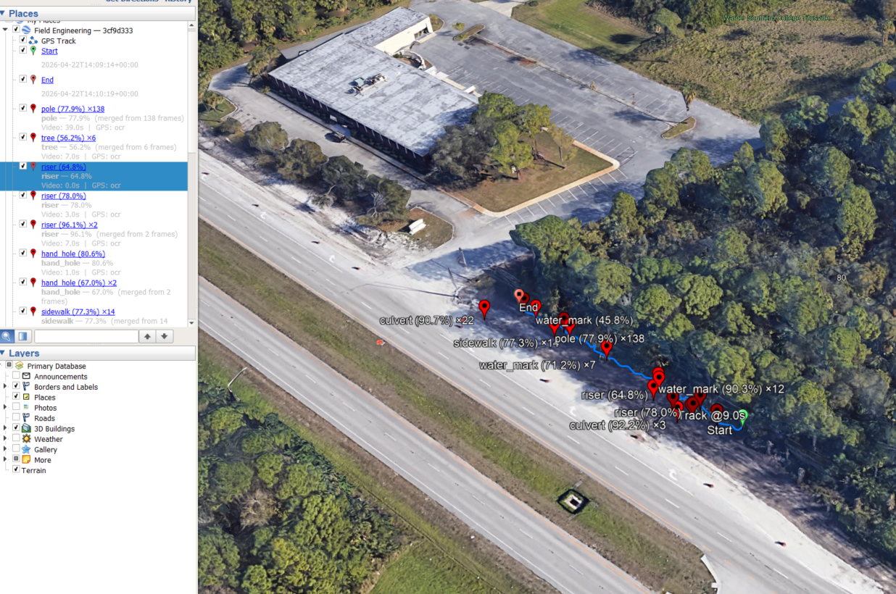
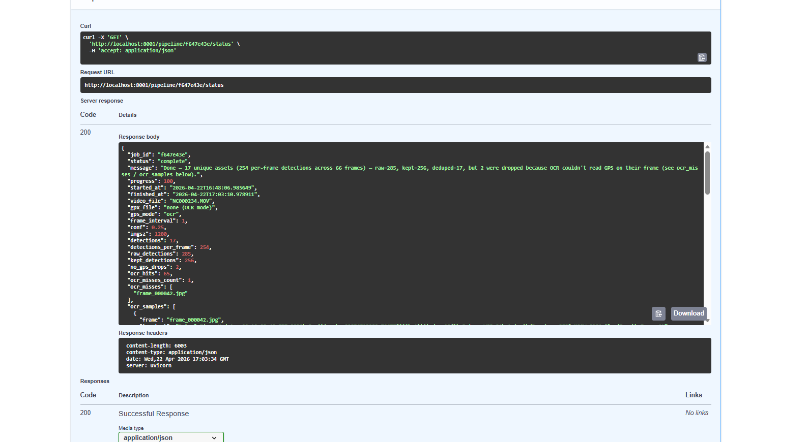
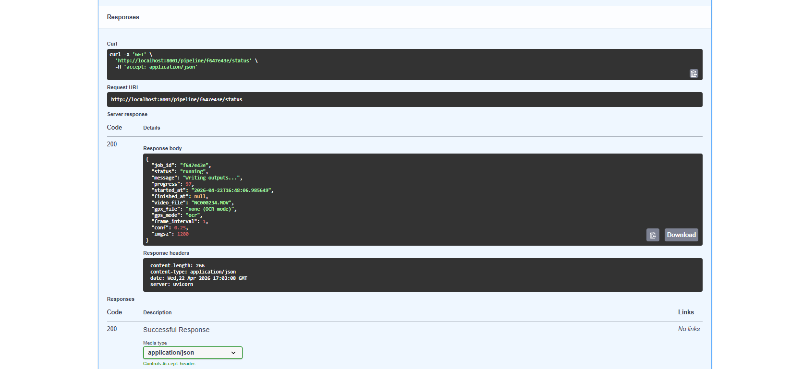
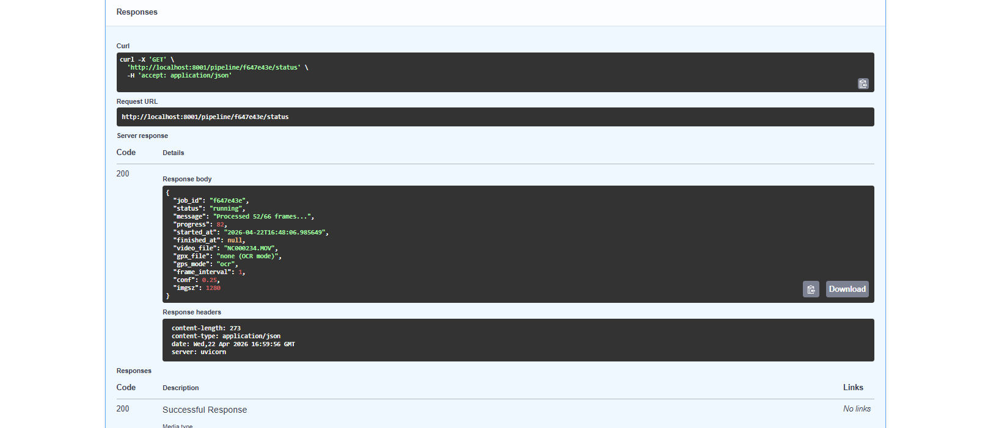
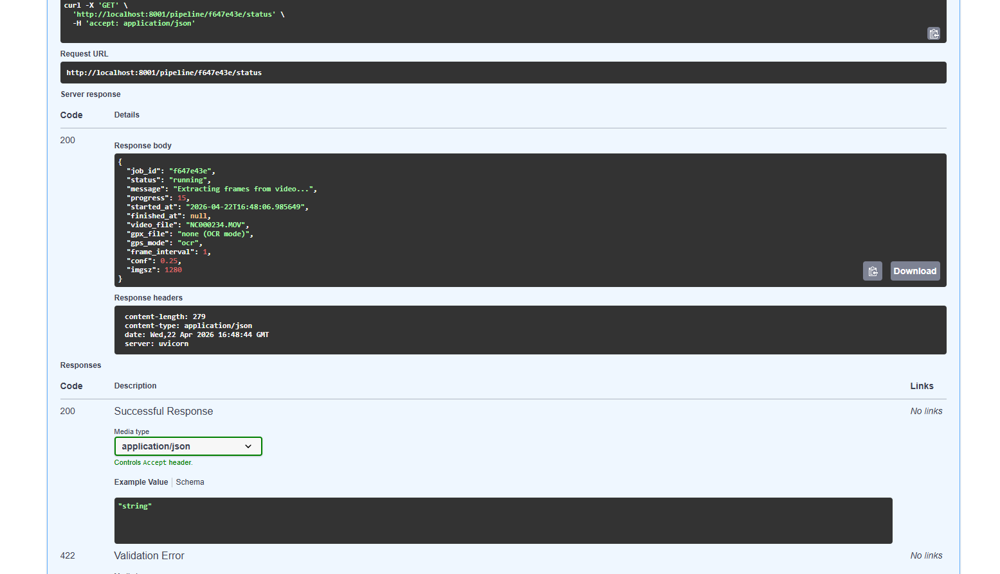
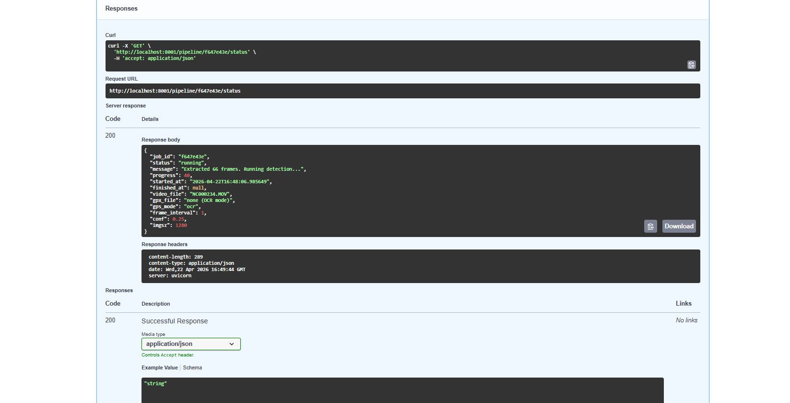
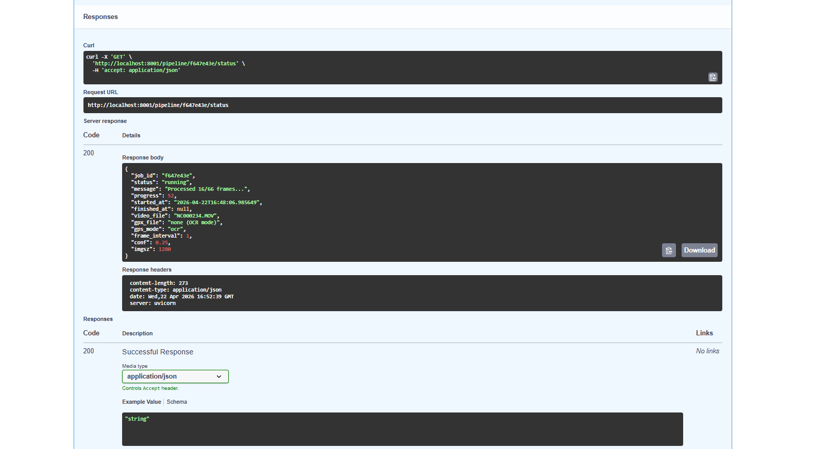

# nav-cam-detect

YOLO-powered utility detection from iPhone NavCam video with GPS OCR and multi-frame triangulation.

Drive a road with the NavCam app recording, drop the `.MOV` on this API, get back a KMZ of geolocated utility assets — poles, streetlights, culverts, hand-holes, risers, trees, sidewalks, water/power marks — ready to open in Google Earth.

## What it does

Given a phone video with GPS + compass bearing burned into each frame (the iPhone NavCam overlay), the pipeline:

1. Samples frames at a configurable interval (`frame_interval`, default 1 fps).
2. Runs YOLO on each frame to detect utility assets. Per-class confidence thresholds are tuned in `CLASS_CONF_OVERRIDE` so over-firing classes can be held to a higher bar.
3. OCRs the top-left GPS/bearing overlay with Google Cloud Vision to recover the camera pose (lat, lon, compass bearing) for every frame. GPX is a fallback if OCR fails.
4. Converts each bounding-box center into an absolute world bearing using the camera pose and the horizontal FOV.
5. Triangulates each asset across frames via a 2×2 least-squares intersection of bearing rays. Clusters that fail the acceptance gates (baseline too short, angular spread too narrow, residual too high, collapsed onto track) fall back to a monocular camera+offset projection with a per-class distance stretch factor.
6. Deduplicates detections across frames (per-class distance threshold + 3-second time gate), cross-class merges (pole/tree/streetlight ambiguity), and emits a single pin per real-world asset.
7. Writes GeoJSON, KML, KMZ (with per-detection crop thumbnails in the balloon), a survey-grade deduplicated CSV, and a triangulation debug CSV that records every cluster's math — including "would-have-solved" coordinates for clusters that were rejected before acceptance.

## Quick start

Prerequisites: Docker + Docker Compose, and a Google Cloud Vision API key (free tier is 1000 image requests/month; see `.env.example`).

```bash
git clone https://github.com/<your-user>/nav-cam-detect.git
cd nav-cam-detect
cp .env.example .env
# edit .env and paste your Google Vision API key in place of API_KEY_REQUIRED
mkdir -p data/{datasets,runs,incoming,predictions,pipeline}
docker compose up -d
```

Then visit `http://localhost:8001/docs` for the interactive Swagger UI.

A trained YOLO weights file is required. Drop `best.pt` under `data/runs/<run-name>/weights/best.pt` — the pipeline's `get_best_model()` finds the most recent `best.pt` it can see. Trained weights are not shipped with this repo because they're dataset-specific; bring your own or train one from Ultralytics starter weights on your own labeled set.

## Example Outputs

### End-to-End Pipeline Execution

**1. API Interface (Swagger UI)**


**2. Job Queued**


**3. Frame Extraction Started**


**4. Detection Running (Initial Progress)**


**5. Mid-Processing Status**


**6. Writing Outputs Phase**


**7. Pipeline Completion Summary (Deduped + Final Counts)**


---

### Geospatial Output (KMZ / GIS)

**8. KMZ Output Overview (All Detected Assets)**


**9. Individual Detection with OCR + Geolocation**


**10. Full Detection List + Asset Classification**


## Running a job

```bash
curl -X POST "http://localhost:8001/pipeline/run" \
  -F "video=@your_video.MOV" \
  -F "frame_interval=1.0" \
  -F "conf=0.25" \
  -F "use_ocr=true"
```

Response includes a `job_id`. Poll its status:

```bash
curl "http://localhost:8001/pipeline/<job_id>/status"
```

When `status=complete`, pull the deliverables:

```bash
curl -o detections.kmz        "http://localhost:8001/pipeline/<job_id>/download/kmz"
curl -o detections_deduped.csv "http://localhost:8001/pipeline/<job_id>/download/assets_csv"
curl -o triangulation_debug.csv "http://localhost:8001/pipeline/<job_id>/download/tri_debug_csv"
curl -o calibration.log        "http://localhost:8001/pipeline/<job_id>/download/calibration_log"
```

## Tuning

All thresholds that matter are module-level constants near the top of `main.py`. Edit and restart (the compose file mounts `main.py` for hot reload via uvicorn's `--reload`).

`CLASS_CONF_OVERRIDE` controls per-class detection confidence. Over-firing classes get raised (`0.55+`); under-firing classes get lowered.

`CLASS_HEIGHTS_M` is the real-world height assumed for each class, used to convert bounding-box pixel height into a monocular distance estimate in the fallback path.

`CAMERA_FOV_H_DEG` / `CAMERA_FOV_V_DEG` is the camera's horizontal/vertical FOV in the video's rendered orientation. Default values target iPhone 14 main lens in portrait (40°H × 68°V). If your device differs, calibrate against a known-width object at a known distance — wrong FOV inflates every projection distance error.

`CALIBRATION_BEARING_OFFSET_DEG` is a global compass bias applied to every projected ray. Use this to correct systematic east/west drift observed against ground truth.

`TRI_STRETCH_DEFAULT` / `TRI_STRETCH_BY_CLASS` scales the raw triangulated distance outward, compensating for a ~20–30 % undershoot we routinely see on walk-toward geometry. Passing-object classes (pole, streetlight, tree, riser) get `1.55`; across-road classes (culvert, hand-hole, manhole, etc.) get `1.30`.

`TRI_MIN_BASELINE_M`, `TRI_MIN_SPREAD_DEG`, `TRI_MAX_RESIDUAL_M`, `TRI_MAX_FARTHEST_M`, `TRI_MIN_CLOSEST_M` are the acceptance gates. The defaults (5 m / 20° / 3 m / 80 m / 2 m) reject most forward-facing walk-by clusters because the geometry is ill-conditioned; the fallback path catches them. Loosen with care — the debug CSV now records raw solved coordinates for every gate rejection so you can see what the math would have placed before changing a gate.

## Output artifacts

Every job produces the following under `data/pipeline/<job_id>/`:

| File | Contents |
| --- | --- |
| `detections.geojson` | Every per-frame detection + the GPS track. Full audit trail. |
| `detections_deduped.geojson` | One feature per deduplicated asset. |
| `detections_deduped.csv` | Survey-grade CSV: `asset_id`, `class`, `solved_lat/lon`, `solve_method`, `num_observations`, `mean_conf`, `baseline_m`, `ray_angle_deg`, `residual_m`, `rejection_reason`, `source_frames`, plus raw triangulation + provenance columns. |
| `detections_triangulation_debug.csv` | Per-cluster diagnostic row: the two most angularly-divergent frames, camera poses, object bearings, baseline, intersection angle, solved lat/lon, residual, accept flag, and reject reason. |
| `detections.kmz` | Google Earth package with pins, per-detection crop thumbnails in each balloon, and the full GPS track. |
| `detections.kml` | Flat KML (same content as the KMZ but unzipped). |
| `calibration.log` | Runtime diagnostics: the stretch factor and bearing offset the process actually used, plus one `[PATH]` + `[TRI_REJECT]` line per cluster. |

## API surface

Routes are grouped under these tags in `/docs`:

- **Video Pipeline** — `POST /pipeline/run`, `GET /pipeline/{job_id}/status`, `GET /pipeline/{job_id}/download/{kind}`.
- **GPS Calibration** — `POST /ocr/set-key`, `GET /ocr/status`.
- **Training / Inference** — model listing, training kickoff, inference on single images/folders (see `/docs`).

## Limitations / known failure modes

Forward-facing walk-toward geometry produces very narrow bearing spreads (often <10°), which fails the triangulation acceptance gates and forces the fallback path. The debug CSV's raw solve columns make this explicit — rays often converge cleanly but onto a point a few meters off the camera track, which is the classic "collapsed onto track" degenerate case. Sidestep by collecting footage with more perpendicular geometry (drive past, not toward) when survey-grade accuracy matters.

Monocular distance from bounding-box pixel height is very sensitive to FOV calibration and class-height assumptions. A wrong FOV or an unusually tall/short real-world asset (e.g. a transmission pole where `CLASS_HEIGHTS_M` expects a distribution pole) will undershoot or overshoot proportionally. Recalibrate FOV before trusting cross-class distance accuracy.

Bearing offset is a single global scalar. Different classes can drift in different directions depending on whether the asset is passed (pole, streetlight) or crossed (culvert, hand-hole) — a flat offset can correct one at the cost of the other. A future version could add a per-class offset.

## License

MIT. See `LICENSE`.
